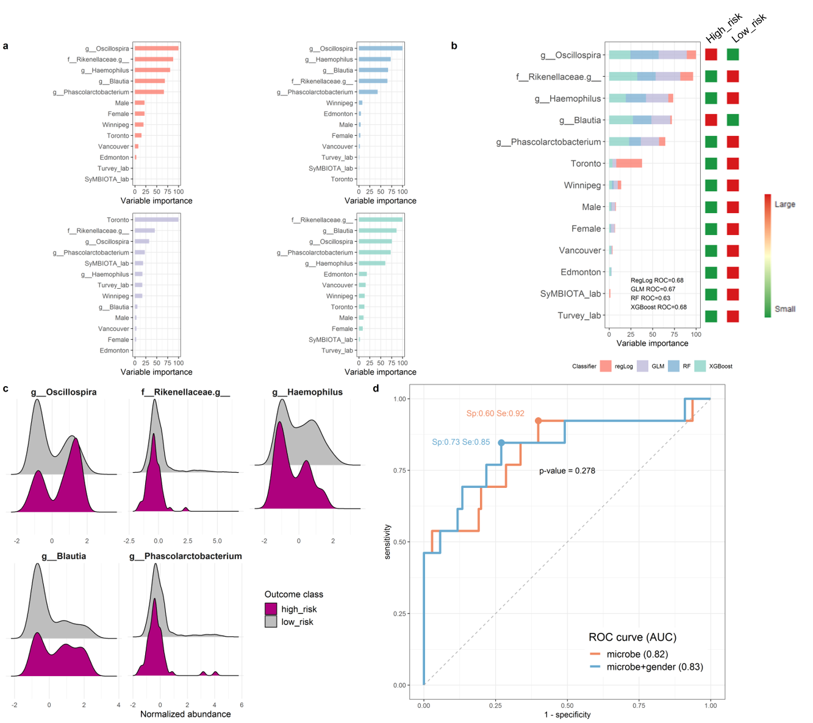
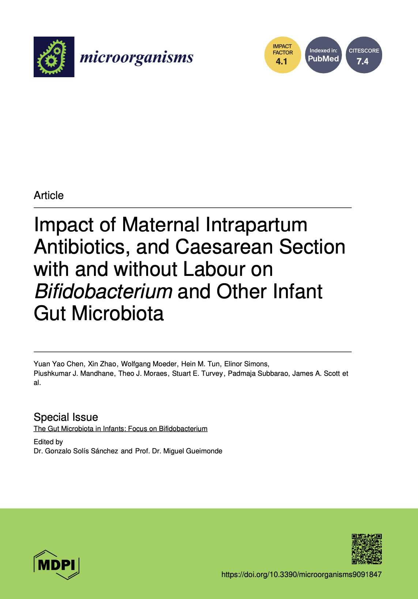
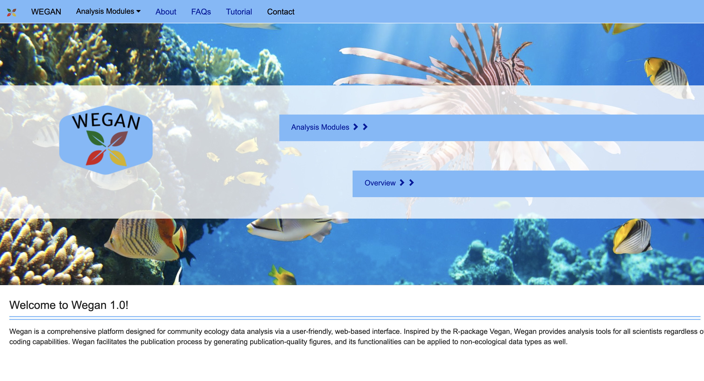

# Portfolio 
--- 
## Microbiome Data Analysis

### Vitamin D and Infant Gut Health: A Regression Analysis

In this project, I analyzed the effects of vitamin D drops, including their non-medicinal excipients like glycerin and 1,2-propanediol, on gut metabolites and microbes in three-month-old infants. Using multiple regression models on data from the CHILD Cohort Study, I explored how vitamin D supplementation influences the infant gut environment, revealing potential impacts on gut microbiota composition and function. [Learn More](about-vitD-infant.md) 

--- 
### Predict Childhood Obesity using RF, XGBoost and GLMM in R

Knowing obesity risk earlier could help healthcare professionals manage children's weight more effectively. This project aims to use fecal microbiome data to predict future obesity risk with machine learning algorithms. Random Forest, XGBoost, GLMM, and Regularized Logistic classifiers were developed based on the data set of 2000+ infants. The optimal classifier achieved an AUC of 0.83 with a specificity of 73% and sensitivity of 85%. [Learn More](about-obesity-predict.md)

---
### Impact of Birth Factors on Infant Gut Health: Insights from a Microbiota Study 

 

This academic project explores how birth factors like Caesarean sections and intrapartum antibiotic prophylaxis affect infant gut microbiota. Using linear and logistic models along with multivariate analysis, we examined the impact on *Bifidobacterium* abundance and overall microbiota diversity. Our findings aim to reveal how these factors shape early gut health and inform better clinical practices. [Learn More](about-infant-bifido-birth.md)

---
## Web Application Development 

### WEGAN: Web Application Streamlining Ecology Data Analysis 

 

Our collaborative project aims to create a web-based software application automating data analysis for ecologists. It utilizes the robust R package 'vegan' within a modern JSF framework. The user-friendly interface allows biologists to analyze their data quickly and easily, even without programming or advanced statistical expertise, generating reproducible reports in minutes.

--- 

