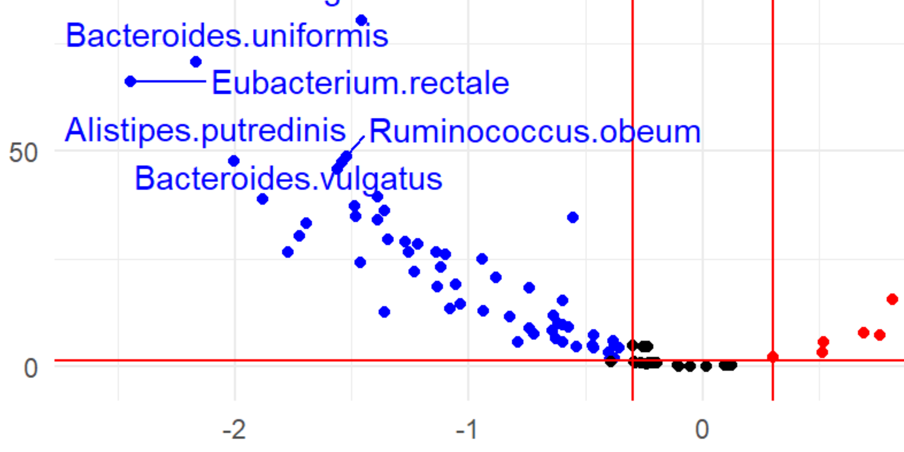
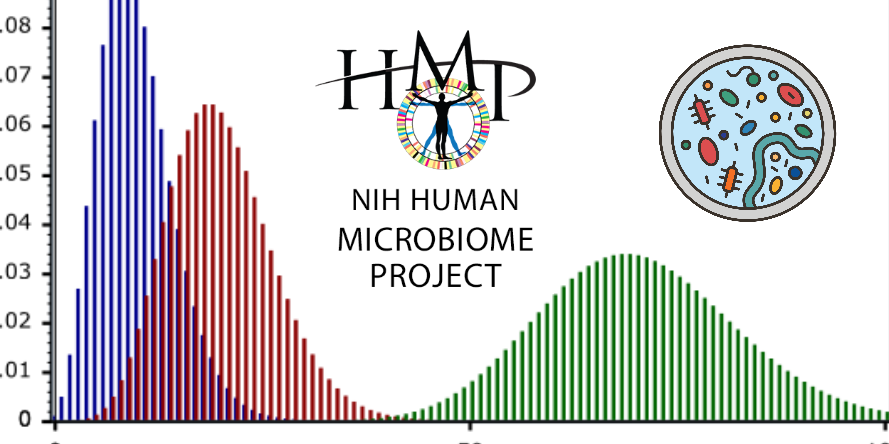

 
<h1 id="identifier" class="heading1">
  Data Science Portfolio
</h1>
 
 
<h3 id="identifier" class="heading3">
Table of Contents
</h3> 
1. [Microbiome Epidemiology](#topic1) 
  1.1 [Impact of vitamin D supplements on infant gut microbiome](#subtopic1) 
  1.2 [Gut microbiota variations between IBD versus healthy adults](#subtopic2) 
  1.3 [Benchmarking algorithms on zero-excessive metagenome data](#subtopic3) 
  1.4 [Differential analysis of microbiota data with over-dispersion using edgeR package](#subtopic4) 
  1.5 [Correlation network development for gut microbial taxa using SparCC](#subtopic5) 
  1.6 [Proportionality of gut microbiome to mitigrate spurious correlation](#subtopic6) 
2. [Machine Learning](#topic2) 
  2.1 [Microbiome-based machine learning models to predict childhood obesity trajectory](#subtopic7) 
3. [Genomic Bioinformatics](#topic3) 
  3.1 [Comparative genomics of Lactobacillus reuteri isolates from gut and sourdough](#subtopic8) 
 
 
<h2 id="identifier" class="heading2">
  🦠Microbiome Epidemiology 
</h2>
--- 

<h3 id="identifier" class="heading3">
  Impact of vitamin D supplements on infant gut microbiome
</h3> 
 
<link rel="stylesheet" href="https://cdn.jsdelivr.net/npm/bulma@0.9.4/css/bulma.min.css">

  Linear Regression
  Logistic Regression
  Cohort study
  Data Reporting
  R

  

In this project, my colleagues and I developed a multiple linear model to investigate the relationship between vitamin D use, fecal metabolites, and microbiota, adjusting for covariables. The project used a cohort dataset of 575 infants. Vitamin D use and some prenatal variables were extracted from questionnaires; fecal metabolites and microbiota data were a readout of the NMR spectrum and high-throughput DNA sequencing, respectively. 

 
 

---
<h3 id="identifier" class="heading3">
Gut microbiota variations between IBD versus healthy adults 
</h3> 
 
<link rel="stylesheet" href="https://cdn.jsdelivr.net/npm/bulma@0.9.4/css/bulma.min.css">

  Mixed-Effect Modeling
  Data Transformation
  Multiple Test Correction
  MaAsLin2

  
  

To detect taxa differentially abundant in IBD patients, I built a generalized mixed-effect model with MaAsLin2 package, considering repeated samples as a random-effect variable. The input metagenomic data and metadata were derived from the openly available IBD dataset of the integrated human microbiome project (iHMP). 

 
 

---
<h3 id="identifier" class="heading3">
Benchmarking algorithms on zero-excessive metagenome data
</h3> 
 
<link rel="stylesheet" href="https://cdn.jsdelivr.net/npm/bulma@0.9.4/css/bulma.min.css">

  Zero-Inflation Model
  Zero-Hurdle Model
  R

  

Four statistical algorithms, zero-inflated negative binomial, zero-inflated Poisson, zero-hurdle negative binomial, and zero-hurdle Poisson have been proposed in the literature to treat excessive zeroness (i.e., zero inflation) in various datatype, including microbiome count data. I benchmarked the four algorithms using microbiome dataset from Human Microbiome Project. Furthermore, I evaluated the performance based on AIC and likelihood ratio test.  

 
 

---

<h3 id="identifier" class="heading3">
Differential analysis of microbiota data with over-dispersion using edgeR package
</h3> 
 
<link rel="stylesheet" href="https://cdn.jsdelivr.net/npm/bulma@0.9.4/css/bulma.min.css">

  edgeR
  Negative Binomial
  Over-dispersion

  

 

The microbiome is often over-dispersed and zero-inflated invalidating assumptions of conventional statistical models. The negative binomial algorithm can address the over-dispersion issue inherent in microbiome count data. In this project, I detected differentially-abundant taxa in IBD patients using the edgeR package that implements negative binomial modeling. 

 

 

---

<h3 id="identifier" class="heading3">
Correlation network development for gut microbial taxa using SparCC 
</h3> 
 
<link rel="stylesheet" href="https://cdn.jsdelivr.net/npm/bulma@0.9.4/css/bulma.min.css">

  Network Correlation
  SparCC
  ggraph

  

Friedman and Alm developed SparCC to infer the correlation network between taxa from microbiome data, effectively dealing with compositionality. This project aims to demonstrate application of SparCC on a microbiome dataset, using Python and R language. 

 

---
<h3 id="identifier" class="heading3">
Proportionality of gut microbiome to mitigrate spurious correlation 
</h3> 
 
<link rel="stylesheet" href="https://cdn.jsdelivr.net/npm/bulma@0.9.4/css/bulma.min.css">

  Relative Correlation
  propr

 

 

Lovell and co-authors (Lovell et al. 2015) proposed the proportionality method for relative correlation, as a valid alternative to absolute correlation. This project, thus, focused on illustrating the proportionality analysis of microbiome data using propr package by Quiin. Consistenet with previous findings, I observed proportionality is a precise indicator of absolute correlation, although sensitivity is limited. 

 

--- 
 
 
<h2 id="identifier" class="heading2">
🤖Machine Learning 
</h2>
--- 
<h3 id="identifier" class="heading3">
Microbiome-based machine learning models to predict childhood obesity trajectory 
</h3> 
 
<link rel="stylesheet" href="https://cdn.jsdelivr.net/npm/bulma@0.9.4/css/bulma.min.css">

  Predictive Modelling
  Random Forest
  XGBoost
  caret

  

Knowing obesity risk earlier could help healthcare professionals manage children's weight more effectively. This project aims to use fecal microbiome data to predict future obesity risk with machine learning algorithms. Random Forest, XGBoost, GLMM, and Regularized Logistic classifiers were developed based on the data set of 2000+ infants. The optimal classifier achieved an AUC of 0.83 with a specificity of 73% and sensitivity of 85%. 

 

 

---
 
 
<h2 id="identifier" class="heading2">
🧬Genomic Bioinformatics 
</h2>
--- 
<h3 id="identifier" class="heading3"> 
Comparative genomics of Lactobacillus reuteri isolates from gut and sourdough  
</h3> 
 

<link rel="stylesheet" href="https://cdn.jsdelivr.net/npm/bulma@0.9.4/css/bulma.min.css">

  standalone BLAST toolkit
  MEGA 5
  MAUVE
  KEGG server

In this project, our team analyzed the genomic adaption of strains from guts to sourdoughs. Using comparative genomics, we pinpointed particular genes under positive selection. In addition, I developed the in-house bioinformatic pipeline, detecting DNA variations among strains. 

 
  
